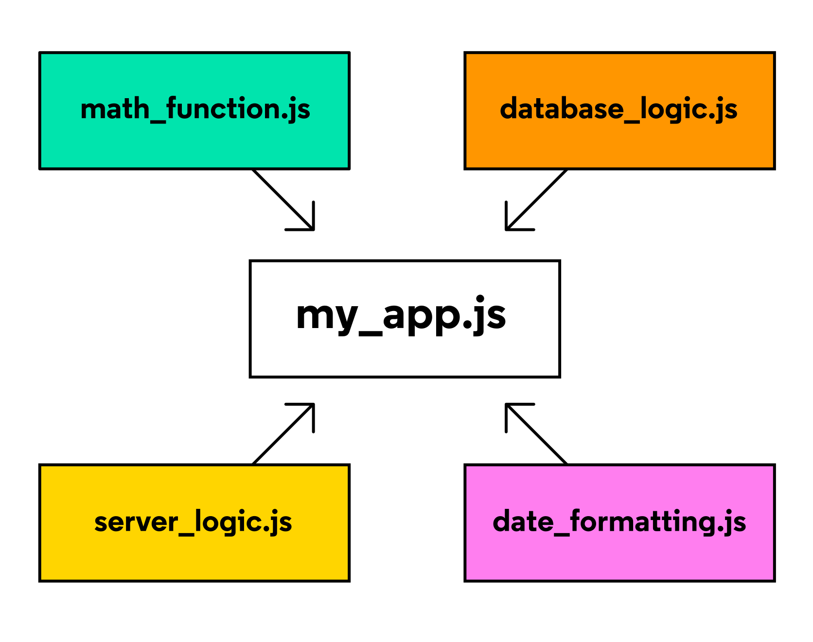
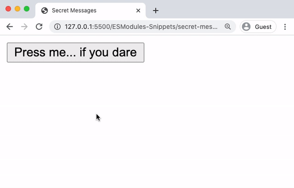

Lesson link:

https://www.codecademy.com/journeys/full-stack-engineer/paths/fscj-22-front-end-development/tracks/fscj-22-javascript-syntax-part-iii/modules/wdcp-22-learn-javascript-syntax-modules-7ac62a4b-087e-4517-9b13-cc0e94b8495d/articles/implementing-modules-using-es-6-syntax


# Implementing Modules using ES6 Syntax

**Article on implementing modules in a browser’s runtime environment using ES6 modules syntax.**

## What are Modules?

Modules are reusable pieces of code in a file that can be exported and then imported for use in another file. A modular program is one whose components can be separated, used individually, and recombined to create a complex system.

Consider the diagram below of an imaginary program written in a file my_app.js:




> Note: The words “module” and “file” are often used interchangably

Instead of having the entire program written within my_app.js, its components are broken up into separate modules that each handle a particular task. For example, the database_logic.js module may contain code for storing and retrieving data from a database. Meanwhile, the date_formatting.js module may contain functions designed to easily convert date values from one format to another (a common headache among programmers!).

This modular strategy is sometimes called separation of concerns and is useful for a number of reasons. What do you think those reasons might be?

 - **Write down a few of your ideas before revealing the reasons below:**

    - By isolating code into separate files, called modules, you can:
      - find, fix, and debug code more easily.
      - reuse and recycle defined logic in different parts of your application.
      - keep information private and protected from other modules.
      - prevent pollution of the global namespace and potential naming collisions, by cautiously selecting variables and behavior we load into a program.


Implementing modules in your program requires a small bit of management. In the remainder of this article, we will be covering:

 - How to use the ES6 export statement to export code from a file - meaning its functions and/or data can be used by other files/modules.
 - How to use the ES6 import statement to import functions and/or data from another module.

# Implementations of Modules in JavaScript: Node.js vs ES6

Before we dive in, it should be noted that there are multiple ways of implementing modules depending on the runtime environment in which your code is executed. In JavaScript, there are two runtime environments and each has a preferred module implementation:

- The Node runtime environment and the module.exports and require() syntax.
- The browser’s runtime environment and the ES6 import/export syntax.

This article will focus on using the ES6 import/export syntax in a browser’s runtime environment. For more information, you can read the articles linked below.

- Implementing Modules In Node
- Introduction to Runtime Environments

# A Brief History of JavaScript Modules in the Browser

In the early days of web development, JavaScript usage was fairly minimal. A script here to add some interactivity to a page and a script there to automate away some simple task. Nowadays, however, JavaScript dominates the web and scripts have ballooned into large and cumbersome behemoths. According to some studies, the average size of a website, in terms of kilobytes of JavaScript data transferred, has grown over 5 times from 2010 to 2020!

These stats aren’t meant to paint a dreary future of web development. Web applications drive much of modern society and are far more capable than could have been imagined when the World Wide Web was created in 1989. Instead, it is to make clear the need for modularity as the capabilities, and size, of these scripts grow.

Though libraries for implementing modules have existed for some time, syntax for natively implementing modules was only introduced in 2015 with the release of ECMAScript 6 (ES6). Since then, it has been adopted by most modern browsers and is the de facto approach for implementing modular applications in the browser.

# Implementing Modules in the Browser

Let’s take a look at implementing modules in the browser through an example. Suppose you wanted to build a simple web application with some hidden text that is revealed when a button is pressed.



To create this website, you could create two files, secret-messages.html and secret-messages.js, and store them together in a folder called secret-messages:
```
secret-messages/
|-- secret-messages.html
|-- secret-messages.js

```
Let’s take a look at the HTML file first:

```
<!-- secret-messages.html --> 
<html>
  <head>
    <title>Secret Messages</title>
  </head>
  <body>
    <button id="secret-button"> Press me... if you dare </button>
    <p id="secret-p" style="display: none"> Modules are fancy! </p>
    <script src="./secret-messages.js"> </script>
  </body>
</html>


```

- The secret-messages.html page renders a button element and a hidden paragraph element.
- It then loads the script secret-messages.js using the file path "./secret-messages.js". The ./ before the file name is how you indicate that the file being referenced (secret-messages.js) is in the same folder as the file referencing it (secret-messages.html).

Speaking of which, let’s take a look at the JavaScript file:

```js
/* secret-messages.js */
const buttonElement = document.getElementById('secret-button');
const pElement = document.getElementById('secret-p');

const toggleHiddenElement = (domElement) => {
    if (domElement.style.display === 'none') {
      domElement.style.display = 'block';
    } else {
      domElement.style.display = 'none';
    }
}

buttonElement.addEventListener('click', () => {
  toggleHiddenElement(pElement);
});


```
- In secret-messages.js, DOM objects are created to reference the button element and paragraph element using the DOM API. These objects are stored in buttonElement and pElement, respectively.
- The function toggleHiddenElement() is declared. It can accept either of these elements as an input called domElement and will either show or hide that element depending on its current style.display value.
- An event listener is added to buttonElement to listen for 'click' events and respond by calling toggleHiddenElement() with pElement as the argument.
Now, suppose you wanted to create a second webpage with similar features. There is still a button, but this time clicking it reveals an image. Using similar logic as the program above, this can be achieved with the following file structure:

```
secret-image/
|-- secret-image.html
|-- secret-image.js

```
The HTML might look like this:
```
<!-- secret-image.html --> 
<html>
  <head>
    <title>Secret Image</title>
  </head>
  <body>
    <button id="secret-button"> Want to see something cool? </button>
    
    <script src="./secret-image.js"> </script>
  </body>
</html>

```
… and the JavaScript might look like this:

```
/* secret-image.js */
const buttonElement = document.getElementById('secret-button');
const imgElement = document.getElementById('secret-img');

const toggleHiddenElement = (domElement) => {
    if (domElement.style.display === 'none') {
      domElement.style.display = 'block';
    } else {
      domElement.style.display = 'none';
    }
}

buttonElement.addEventListener('click', () => {
  toggleHiddenElement(imgElement);
});

```
Given that much of the code in these two programs is similar, creating this second website was fairly straightforward. In particular, notice that the toggleHiddenElement() function is copied line for line from secret-messages.js.

Having two identical, but separate, copies of a function can lead to maintenance issues in the future. For example, any bugs that may exist within the function would need to be fixed in two places rather than one.

Instead, creating a single copy of toggleHiddenElement() within a module that exports it would allow these two websites to import and use the exact same function. With this approach, updates to the function only need to occur within the module that defines them, and all programs that import this function will receive the same update. Furthermore, additional functions could be exported by the module and used by both programs, further reducing repetition.

ES6 Named Export Syntax
A module must be entirely contained within a file. So, let’s first consider where a new module may be placed within the file system. Since it needs to be used by both of these projects, you may want to put it in a mutually accessible location. The entire file structure containing both projects and this new module, let’s call it dom-functions.js, could look like this:
```
secret-image/
|-- secret-image.html
|-- secret-image.js
secret-messages/
|-- secret-messages.html
|-- secret-messages.js
modules/
|-- dom-functions.js    <-- new module file
```
Inside dom-functions.js, the functions you wish to reuse can be exported using the named export syntax below:

export { resourceToExportA, resourceToExportB, ...}

Using this syntax, the name of each exported resource is listed between curly braces and separated by commas. Below, you can see how this is implemented in the new module file dom-functions.js:

```
/* dom-functions.js */
const toggleHiddenElement = (domElement) => {
    if (domElement.style.display === 'none') {
      domElement.style.display = 'block';
    } else {
      domElement.style.display = 'none';
    }
}

const changeToFunkyColor = (domElement) => {
  const r = Math.random() * 255;
  const g = Math.random() * 255;
  const b = Math.random() * 255;
        
  domElement.style.background = `rgb(${r}, ${g}, ${b})`;
}

export { toggleHiddenElement, changeToFunkyColor };

```
Let’s briefly break down how this module works:

- The function toggleHiddenElement() is declared. It accepts a domElement as an input and either shows or hides that element depending on its current display style value.
- A new function changeToFunkyColor() is declared. It accepts a domElement as an input and then sets its background color to a random rgb() color value.
- The two functions are exported using the ES6 export statement.

These exported functions are now available to be imported and used by other files!

> If you want to try this out on your own computer, you will need to spin up a local server or else you will run into CORS issues. Check out this article on creating a local server with VSCode and the Live Server extension.

In addition to the syntax above, in which all named exports are listed together, individual values may be exported as named exports by simply placing the export keyword in front of the variable’s declaration. Here is the same example using this syntax:

```
/* dom-functions.js */
export const toggleHiddenElement = (domElement) => {
  // logic omitted...
}

export const changeToFunkyColor = (domElement) => {
  // logic omitted...
}

```
# ES6 Import Syntax

The ES6 syntax for importing named resources from modules is similar to the export syntax:
```
import { exportedResourceA, exportedResourceB } from '/path/to/module.js';
```
Let’s update the secret-messages program such that it now imports functionality from dom-functions.js. Doing so requires two important steps. First, update secret-messages.js:
```
/* secret-messages.js */
import { toggleHiddenElement, changeToFunkyColor } from '../modules/dom-functions.js';

const buttonElement = document.getElementById('secret-button');
const pElement = document.getElementById('secret-p');

buttonElement.addEventListener('click', () => {
  toggleHiddenElement(pElement);
  changeToFunkyColor(buttonElement);
});
```

Let’s break down these changes:

- In secret-messages.js, the functions toggleHiddenElement() and changeToFunkyColor() are imported from the module ../modules/dom-functions.js. The ../ indicates that the modules/ folder is in the same folder as the parent folder, secret-messages/.
- When the button is clicked, the now imported toggleHiddenElement() function is called with pElement as an argument.
- In addition, changeToFunkyColor() is called with buttonElement as an argument, changing its background color to a random one!

Now, you must also update secret-messages.html:
```
<!-- secret-messages.html --> 
<html>
  <head>
    <title>Secret Messages</title>
  </head>
  <body>
    <button id="secret-button"> Press me... if you dare </button>
    <p id="secret-p" style="display: none"> Modules are fancy! </p>
    <script type="module" src="./secret-messages.js"> </script>
  </body>
</html>


```
The change here is subtle, can you spot it? In secret-messages.html, the only thing that changes is the addition of the attribute type='module' to the <script> element. Failure to do so can cause some browsers to throw an error. For example, in Chrome you might see this error:

And those are the basics of exporting and importing using the ES6 export and import syntax! If you have been following along with these code examples, see if you can update the secret-image project to use the exported functions from the module dom-functions.js before continuing on to the challenges below.

